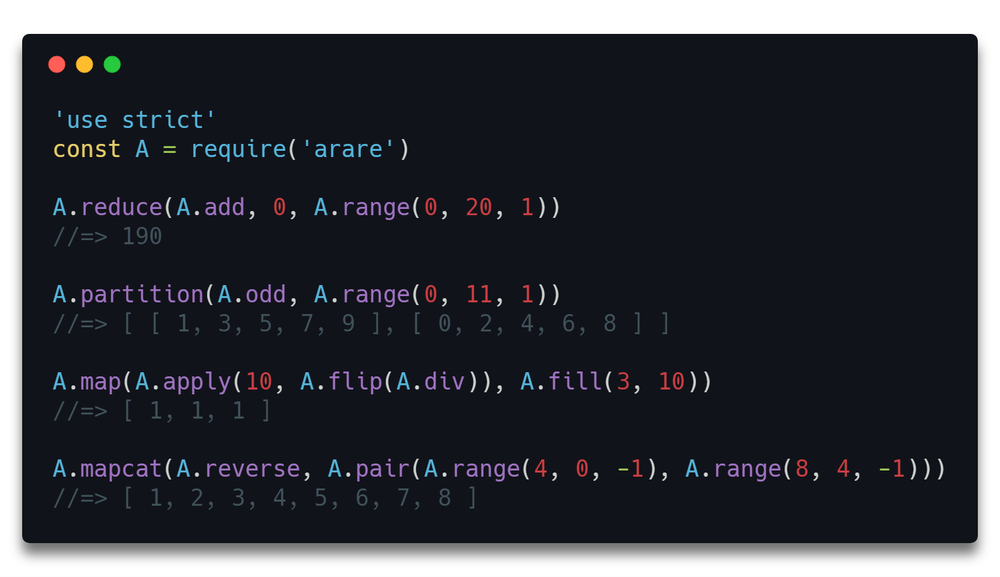
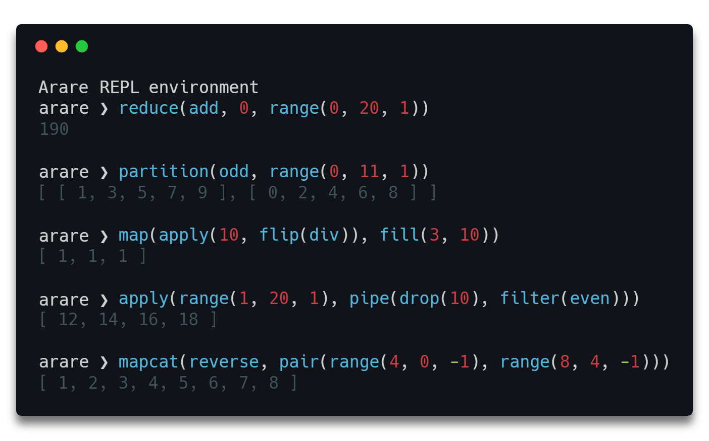

<h1 align="center">
  Arare
</h1>

<h4 align="center">
  🍘 Lightweight auto-curried functional programming library
</h4>

<div align="center">
  
</div>

<p align="center">
  <a href="https://travis-ci.com/klauscfhq/arare">
    
  </a>
</p>

## Description

Lightweight and without any external dependencies arare enables you to write tacit, point-free, declarative & clean code while avoiding side-effects and mutations. Internally the library itself, comprised of over 200 functions, follows the functional programming paradigm and is materialized using fundamental functional qualities such as currying, recursion, tail calls, high-order functions, referential transparency, side-effects elimination and function composition. Additionally, arare utilizes automatic [variadic](https://en.wikipedia.org/wiki/Variadic_function) [currying](https://en.wikipedia.org/wiki/Currying) for its functions, thus allowing the user to write more flexible, practical & minimal code, compared to regular strict currying. Finally, the library comes with a build-in interactive REPL environment, useful for directly inspecting and experimenting with all available modules without leaving the console.

Please note that project is in its early days and that it is currently under active development.

Come over to [Gitter](https://gitter.im/klauscfhq/arare) or [Twitter](https://twitter.com/klauscfhq) to share your thoughts on the project.


## Highlights

- Over 200 available functions
- Build-in interactive REPL
- Point-free & tacit
- High-order & pure functions
- Automatic variadic currying
- Declarative & minimal syntax
- Side-effects & mutations free
- Lightweight with zero dependencies
- Build with functional code
- Actively developed

## Contents

- [Description](#description)
- [Highlights](#highlights)
- [Install](#install)
- [Usage](#usage)
- [REPL](#repl)
- [API](#api)
- [Development](#development)
- [Team](#team)
- [License](#license)

## Install

```bash
npm install arare
```

## Usage

Import arare and start using directly any of the available modules.

```js
const A = require('arare')

A.map(A.add(10), A.range(1, 4, 1))
//=> [11, 12, 13]
```

Alternatively, select and import only the modules that you need.

```js
const {add, map, range} = require('arare')

map(add(10), range(1, 4, 1))
//=> [11, 12, 13]
```

## REPL

Initially, install arare globally in order to be able to access the REPL environment.

```
npm install -g arare
```

To launch the REPL simply type `arare` from anywhere in your console.

```bash
arare # launch REPL
```

<div align="center">
  
</div>

## API

The following lists contain all available functions grouped into categories according to the type of their respective returning value.

An alphabetically ordered list of all available functions can be found [**here**](docs/api.EN.md).


#### `Any`

<details>
<summary>Functions whose return value <b>varies</b> according to their input.</summary>

<br/>

- [`apply`](docs/api.EN.md#apply)
- [`applyArgs`](docs/api.EN.md#applyArgs)
- [`ext`](docs/api.EN.md#ext)
- [`find`](docs/api.EN.md#find)
- [`fst`](docs/api.EN.md#fst)
- [`getNth`](docs/api.EN.md#getNth)
- [`head`](docs/api.EN.md#head)
- [`id`](docs/api.EN.md#id)
- [`ite`](docs/api.EN.md#ite)
- [`last`](docs/api.EN.md#last)
- [`reduce`](docs/api.EN.md#reduce)
- [`reduceRight`](docs/api.EN.md#reduceRight)
- [`snd`](docs/api.EN.md#snd)
- [`startsWith`](docs/api.EN.md#startsWith)
- [`trd`](docs/api.EN.md#trd)
- [`xapply`](docs/api.EN.md#xapply)

<br/>

</details>

#### `Array`

<details>
<summary>Functions whose return value is an <b>array</b>.</summary>

<br/>

- [`append`](docs/api.EN.md#append)
- [`appendTo`](docs/api.EN.md#appendTo)
- [`array`](docs/api.EN.md#array)
- [`arrayify`](docs/api.EN.md#arrayify)
- [`arrayMinMax`](docs/api.EN.md#arrayMinMax)
- [`breakWhen`](docs/api.EN.md#breakWhen)
- [`concat`](docs/api.EN.md#concat)
- [`copy`](docs/api.EN.md#copy)
- [`drop`](docs/api.EN.md#drop)
- [`dropRight`](docs/api.EN.md#dropRight)
- [`dropRightWhile`](docs/api.EN.md#dropRightWhile)
- [`dropWhile`](docs/api.EN.md#dropWhile)
- [`empty`](docs/api.EN.md#empty)
- [`entries`](docs/api.EN.md#entries)
- [`erase`](docs/api.EN.md#erase)
- [`Fs`](docs/api.EN.md#Fs)
- [`fill`](docs/api.EN.md#fill)
- [`filter`](docs/api.EN.md#filter)
- [`flatten`](docs/api.EN.md#flatten)
- [`halve`](docs/api.EN.md#halve)
- [`init`](docs/api.EN.md#init)
- [`keys`](docs/api.EN.md#keys)
- [`map`](docs/api.EN.md#map)
- [`mapcat`](docs/api.EN.md#mapcat)
- [`merge`](docs/api.EN.md#merge)
- [`mergeBy`](docs/api.EN.md#mergeBy)
- [`ones`](docs/api.EN.md#ones)
- [`pair`](docs/api.EN.md#pair)
- [`partition`](docs/api.EN.md#partition)
- [`partitionAt`](docs/api.EN.md#partitionAt)
- [`prepend`](docs/api.EN.md#prepend)
- [`prependTo`](docs/api.EN.md#prependTo)
- [`props`](docs/api.EN.md#props)
- [`range`](docs/api.EN.md#range)
- [`reject`](docs/api.EN.md#reject)
- [`remove`](docs/api.EN.md#remove)
- [`remove`](docs/api.EN.md#removeAll)
- [`remove`](docs/api.EN.md#removeRight)
- [`replace`](docs/api.EN.md#replace)
- [`replaceAll`](docs/api.EN.md#replaceAll)
- [`reverse`](docs/api.EN.md#reverse)
- [`setHead`](docs/api.EN.md#setHead)
- [`setHeadWith`](docs/api.EN.md#setHeadWith)
- [`setLast`](docs/api.EN.md#setLast)
- [`setLastWith`](docs/api.EN.md#setLastWith)
- [`setNth`](docs/api.EN.md#setNth)
- [`setNthWith`](docs/api.EN.md#setNthWith)
- [`shift`](docs/api.EN.md#shift)
- [`shiftLeft`](docs/api.EN.md#shiftLeft)
- [`slice`](docs/api.EN.md#slice)
- [`split`](docs/api.EN.md#split)
- [`swap`](docs/api.EN.md#swap)
- [`Ts`](docs/api.EN.md#Ts)
- [`tail`](docs/api.EN.md#tail)
- [`take`](docs/api.EN.md#take)
- [`takeRight`](docs/api.EN.md#takeRight)
- [`takeRightWhile`](docs/api.EN.md#takeRightWhile)
- [`takeWhile`](docs/api.EN.md#takeWhile)
- [`values`](docs/api.EN.md#values)
- [`xshift`](docs/api.EN.md#xshift)
- [`xshiftLeft`](docs/api.EN.md#xshiftLeft)
- [`zeros`](docs/api.EN.md#zeros)
- [`zip`](docs/api.EN.md#zip)
- [`zipReverse`](docs/api.EN.md#zipReverse)
- [`zipSelf`](docs/api.EN.md#zipSelf)
- [`zipTail`](docs/api.EN.md#zipTail)
- [`zipWith`](docs/api.EN.md#zipWith)

<br/>

</details>

#### `Boolean`

<details>
<summary>Functions whose return value is a <b>boolean</b>.</summary>

<br/>

- [`and`](docs/api.EN.md#and)
- [`bool`](docs/api.EN.md#bool)
- [`endsWith`](docs/api.EN.md#endsWith)
- [`eq`](docs/api.EN.md#eq)
- [`eqProp`](docs/api.EN.md#eqProp)
- [`even`](docs/api.EN.md#even)
- [`every`](docs/api.EN.md#every)
- [`excludes`](docs/api.EN.md#excludes)
- [`F`](docs/api.EN.md#F)
- [`gt`](docs/api.EN.md#gt)
- [`gte`](docs/api.EN.md#gte)
- [`hasProp`](docs/api.EN.md#hasProp)
- [`includes`](docs/api.EN.md#includes)
- [`isArr`](docs/api.EN.md#isArr)
- [`isDate`](docs/api.EN.md#isDate)
- [`isDef`](docs/api.EN.md#isDef)
- [`isEmpty`](docs/api.EN.md#isEmpty)
- [`isFn`](docs/api.EN.md#isFn)
- [`isInt`](docs/api.EN.md#isInt)
- [`isLower`](docs/api.EN.md#isLower)
- [`isNeg`](docs/api.EN.md#isNeg)
- [`isNil`](docs/api.EN.md#isNil)
- [`isNull`](docs/api.EN.md#isNull)
- [`isNum`](docs/api.EN.md#isNum)
- [`isObj`](docs/api.EN.md#isObj)
- [`isPair`](docs/api.EN.md#isPair)
- [`isPos`](docs/api.EN.md#isPos)
- [`isRegExp`](docs/api.EN.md#isRegExp)
- [`isStr`](docs/api.EN.md#isStr)
- [`isUndef`](docs/api.EN.md#isUndef)
- [`isUpper`](docs/api.EN.md#isUpper)
- [`lt`](docs/api.EN.md#lt)
- [`lte`](docs/api.EN.md#lte)
- [`nand`](docs/api.EN.md#nand)
- [`none`](docs/api.EN.md#none)
- [`nor`](docs/api.EN.md#nor)
- [`not`](docs/api.EN.md#not)
- [`notArr`](docs/api.EN.md#notArr)
- [`notDate`](docs/api.EN.md#notDate)
- [`notEmpty`](docs/api.EN.md#notEmpty)
- [`notFn`](docs/api.EN.md#notFn)
- [`notInt`](docs/api.EN.md#notInt)
- [`notLower`](docs/api.EN.md#notLower)
- [`notNil`](docs/api.EN.md#notNil)
- [`notNull`](docs/api.EN.md#notNull)
- [`notNum`](docs/api.EN.md#notNum)
- [`notObj`](docs/api.EN.md#notObj)
- [`notPair`](docs/api.EN.md#notPair)
- [`notRegExp`](docs/api.EN.md#notRegExp)
- [`notStr`](docs/api.EN.md#notStr)
- [`notUpper`](docs/api.EN.md#notUpper)
- [`odd`](docs/api.EN.md#odd)
- [`or`](docs/api.EN.md#or)
- [`some`](docs/api.EN.md#some)
- [`startsWith`](docs/api.EN.md#startsWith)
- [`T`](docs/api.EN.md#T)
- [`uneq`](docs/api.EN.md#uneq)
- [`uneqProp`](docs/api.EN.md#uneqProp)
- [`xnor`](docs/api.EN.md#xnor)
- [`xor`](docs/api.EN.md#xor)

<br/>

</details>

#### `Function`

<details>
<summary>Functions whose return value is a <b>function</b>.</summary>

<br/>

- [`arity`](docs/api.EN.md#arity)
- [`binary`](docs/api.EN.md#binary)
- [`comp`](docs/api.EN.md#comp)
- [`cons`](docs/api.EN.md#cons)
- [`curry`](docs/api.EN.md#curry)
- [`flip`](docs/api.EN.md#flip)
- [`gather`](docs/api.EN.md#gather)
- [`nullary`](docs/api.EN.md#nullary)
- [`partial`](docs/api.EN.md#partial)
- [`partialRight`](docs/api.EN.md#partialRight)
- [`pipe`](docs/api.EN.md#pipe)
- [`reverseArgs`](docs/api.EN.md#reverseArgs)
- [`spread`](docs/api.EN.md#spread)
- [`ternary`](docs/api.EN.md#ternary)
- [`unary`](docs/api.EN.md#unary)
- [`xarray`](docs/api.EN.md#xarray)
- [`xcurry`](docs/api.EN.md#xcurry)

<br/>

</details>

#### `Number`

<details>
<summary> Functions whose return value is a <b>number</b>.</summary>

<br/>

- [`abs`](docs/api.EN.md#abs)
- [`absDiff`](docs/readme.md#absDiff)
- [`add`](docs/api.EN.md#add)
- [`adjustIndex`](docs/api.EN.md#adjustIndex)
- [`arrayMax`](docs/api.EN.md#arrayMax)
- [`arrayMin`](docs/api.EN.md#arrayMin)
- [`ceil`](docs/api.EN.md#ceil)
- [`count`](docs/api.EN.md#count)
- [`cube`](docs/api.EN.md#cube)
- [`decr`](docs/api.EN.md#decr)
- [`div`](docs/api.EN.md#div)
- [`fact`](docs/api.EN.md#fact)
- [`findIndex`](docs/api.EN.md#findIndex)
- [`gcd`](docs/api.EN.md#gcd)
- [`incr`](docs/api.EN.md#incr)
- [`lcm`](docs/api.EN.md#lcm)
- [`len`](docs/api.EN.md#len)
- [`max`](docs/api.EN.md#max)
- [`min`](docs/api.EN.md#min)
- [`minMax`](docs/api.EN.md#minMax)
- [`mod`](docs/api.EN.md#mod)
- [`mult`](docs/api.EN.md#mult)
- [`neg`](docs/api.EN.md#neg)
- [`num`](docs/api.EN.md#num)
- [`one`](docs/api.EN.md#one)
- [`pow`](docs/api.EN.md#pow)
- [`prod`](docs/api.EN.md#prod)
- [`recip`](docs/api.EN.md#recip)
- [`square`](docs/api.EN.md#square)
- [`sub`](docs/api.EN.md#sub)
- [`sum`](docs/api.EN.md#sum)
- [`trunc`](docs/api.EN.md#trunc)
- [`zero`](docs/api.EN.md#zero)

<br/>

</details>

#### `String`

<details>
<summary>Functions whose return value is a <b>string</b>.</summary>

<br/>

- [`append`](docs/api.EN.md#append)
- [`appendTo`](docs/api.EN.md#appendTo)
- [`breakWhen`](docs/api.EN.md#breakWhen)
- [`concat`](docs/api.EN.md#concat)
- [`drop`](docs/api.EN.md#drop)
- [`dropRight`](docs/api.EN.md#dropRight)
- [`dropRightWhile`](docs/api.EN.md#dropRightWhile)
- [`dropWhile`](docs/api.EN.md#dropWhile)
- [`empty`](docs/api.EN.md#empty)
- [`halve`](docs/api.EN.md#halve)
- [`init`](docs/api.EN.md#init)
- [`join`](docs/api.EN.md#join)
- [`partition`](docs/api.EN.md#partition)
- [`partitionAt`](docs/api.EN.md#partitionAt)
- [`prepend`](docs/api.EN.md#prepend)
- [`prependTo`](docs/api.EN.md#prependTo)
- [`remove`](docs/api.EN.md#remove)
- [`remove`](docs/api.EN.md#removeAll)
- [`remove`](docs/api.EN.md#removeRight)
- [`replace`](docs/api.EN.md#replace)
- [`replaceAll`](docs/api.EN.md#replaceAll)
- [`reverse`](docs/api.EN.md#reverse)
- [`setHead`](docs/api.EN.md#setHead)
- [`setHeadWith`](docs/api.EN.md#setHeadWith)
- [`setLast`](docs/api.EN.md#setLast)
- [`setLastWith`](docs/api.EN.md#setLastWith)
- [`setNth`](docs/api.EN.md#setNth)
- [`setNthWith`](docs/api.EN.md#setNthWith)
- [`shift`](docs/api.EN.md#shift)
- [`shiftLeft`](docs/api.EN.md#shiftLeft)
- [`slice`](docs/api.EN.md#slice)
- [`str`](docs/api.EN.md#str)
- [`swap`](docs/api.EN.md#swap)
- [`tail`](docs/api.EN.md#tail)
- [`take`](docs/api.EN.md#take)
- [`takeRight`](docs/api.EN.md#takeRight)
- [`takeRightWhile`](docs/api.EN.md#takeRightWhile)
- [`takeWhile`](docs/api.EN.md#takeWhile)
- [`toLower`](docs/api.EN.md#toLower)
- [`toUpper`](docs/api.EN.md#toUpper)
- [`xshift`](docs/api.EN.md#xshift)
- [`xshiftLeft`](docs/api.EN.md#xshiftLeft)

<br/>

</details>

#### `Object`

<details>
<summary>Functions whose return value is a plain <b>object</b>.</summary>

<br/>

- [`assign`](docs/api.EN.md#assign)
- [`assignWith`](docs/api.EN.md#assignWith)
- [`copy`](docs/api.EN.md#copy)
- [`countAll`](docs/api.EN.md#countAll)
- [`countBy`](docs/api.EN.md#countBy)
- [`countIn`](docs/api.EN.md#countIn)
- [`zipObj`](docs/api.EN.md#zipObj)

<br/>

</details>

#### `Undefined`

<details>
<summary>Functions whose return value is <b>undefined</b>.</summary>

<br/>

- [`forEach`](docs/api.EN.md#forEach)

<br/>

</details>

## Development

- Fork the repository and clone it to your machine
- Navigate to your local fork: `cd arare`
- Install the project dependencies: `npm install` or `yarn install`
- Lint the code and run the tests: `npm test` or `yarn test`

## Team

- Klaus Sinani [(@klauscfhq)](https://github.com/klauscfhq)

## License

[MIT](https://github.com/klauscfhq/arare/blob/master/license.md)
